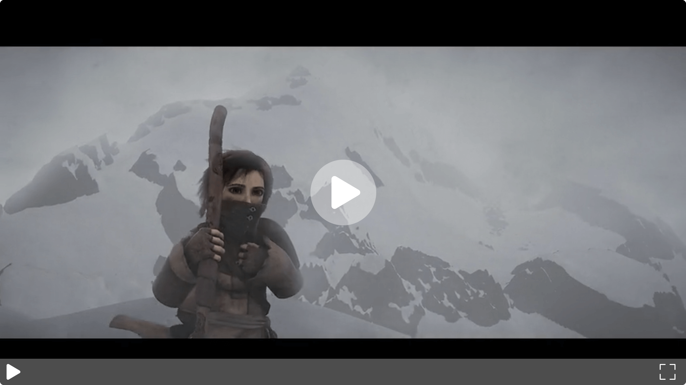
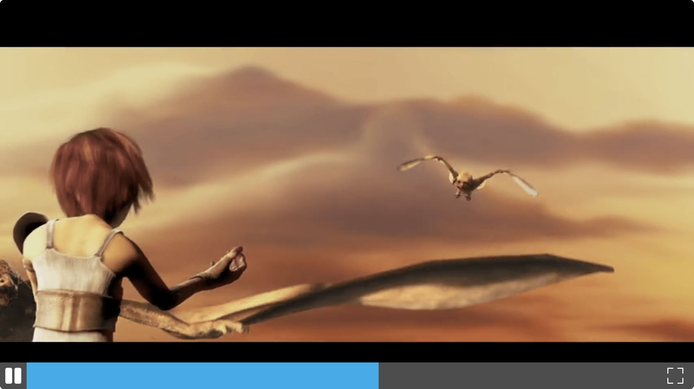

# vuejs-video-player

> Simple video player for Vuejs

|  |  |
| ------------------------------------- | --------------------------------------- |


## Instalation

```js
npm -i vuejs-video-player
```

or

```js
yarn add vuejs-video-player
```

## Usage

### Browser

```html
<script type="text/javascript" src="https://cdn.jsdelivr.net/npm/vue"></script>
<script type="text/javascript" src="node_modules/vuejs-video-player/dist/vuejs-video-player.min.js"></script>
<script type="text/javascript">
  Vue.use(VueVideoPlayer);
</script>
```

### Module

```js
import VueVideoPlayer from "vuejs-video-player";
```

## Todo

- [ ] Volume controls
- [ ] SVG icons to HTML elements for easier editinng
